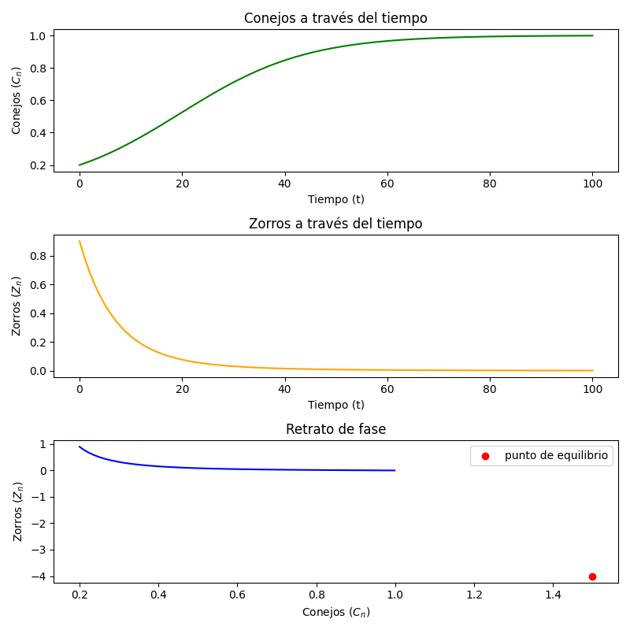
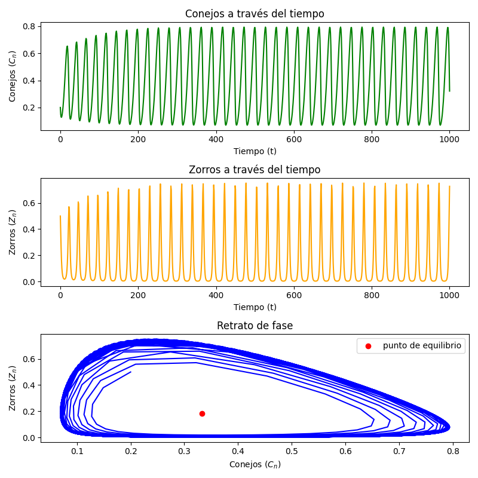
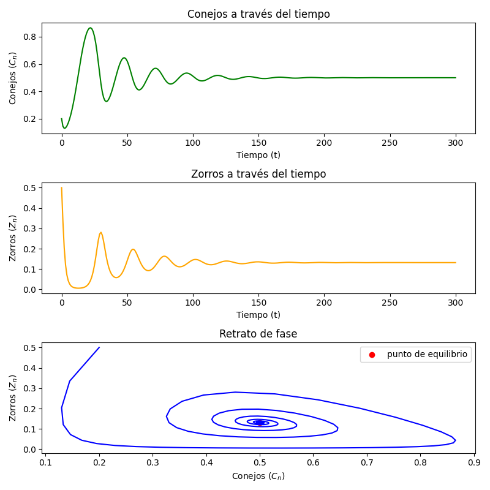

# Modelo depredador-presa de Lotka-Volterra 

## Introducción 
El modelo depredador-presa de Lotka-Volterra es un sistema biológico en el que dos
especies interactúan, una como presa P y otra como depredador D.

En este ejemplo, pongamos la población de conejos C (presas) como la variable a controlar, los encargados de controlar esta población serán los zorros Z (depredador).

Se usará el modelo de Lotka-Volterra (sistema de ecuaciones en diferencias) para ver como evolucionan los conejos y los zorros cuando interactuan entre ellos.


## Construccion del modelo

### Modelo matematico

Para empezar, la cantidad de conejos en un tiempo $n+1$ está dada por la cantidad de conejos que ya había en el tiempo $n$, más la cantidad de nuevos conejos que hay de un tiempo $n$ al $n+1$. $(C_{n+1} = C_n + rC_n)$.

Como los conejos estan en un espacio que no puede crecer infinitamente, consideramos la ecuacion logistica que nos limita a un espacio que tiene una capacidad "limite". Entonces los conejos siguen la ecuación $(C_{n+1} = C_n + rC_n - rC_n^2)$

Solo nos hace falta que consideremos la cantidad de conejos que los zorros van a cazar. Eso se ve como la interacción entre conejos y zorros multiplicado por la tasa de exito que los segundos tienen.  ($b C_{n} Z_{n}$)

Entonces podemos modelar a los conejos de la forma:

* $C_{n+1} = C_n + rC_n - rC_n^2 - b C_{n} Z_{n}$

  

Ahora veamos con los zorros. Para saber cuantos zorros tenemos en el momento $n+1$, es la cantidad que habia en el momento $n$ menos la cantidad que se muere ($\ d Z_n$) pero a la vez le sumamos la tasa de exito que tienen los zorros (en relacion con como se relacionan los conejos y zorros, es decir, $c Z_n C_n$)

Los zorros quedaria de la forma: $Z_{n+1} = Z_n - d Z_n + c Z_n C_n$

  

Por lo tanto ya tenemos el modelo con el que podemos ver como se relacionarian los conejos con los zorros.


$$
\begin{cases}
C_{n+1} = C_n + rC_n - rC_n^2 - b C_{n} Z_{n}\\
Z_{n+1} = Z_n - d Z_n + c Z_n C_n
\end{cases}
$$


En donde intervienen las siguientes variables:

* $r$ la tasa de crecimiento de los conejos: representa el potencial reproductivo biológico de los conejos.

* $b$ la tasa de exito de caza sobre los conejos: es la eficiencia del depredador para reducir la población de presas

* $d$ es la mortalidad de los zorros: representa la mortalidad natural o la rapidez con la que los zorros mueren si no encuentran alimento

* $c$ Tasa de éxito de caza sobre el depredador: Representa qué tan eficiente es el depredador para convertir la proteína de conejo en "nuevos zorros".


### Modelo Computacional / Numerico
Una vez que tenemos el modelo matematico es sencillo llegar al modelo computacional pues solo debemos programar el sistema de ecuaciones.

Basta con una funcion que toma todos los parametros y ejecuta el algoritmo una cantidad finita de veces. Lo programamos de la siguiente forma.


```python
def sistema(Co, Zo, r, c, b, d, n):

    C = [Co]
    Z = [Zo]

    for _ in range(n):
        Cn = C[-1]
        Zn = Z[-1]

        C.append( Cn + r*Cn*(1-Cn) - b*Cn*Zn ) 
        Z.append( Zn - d*Zn + c*Zn*Cn)

    tiempos = range(n+1)
    point_x = d/c 
    point_y = (r*(c-d)) / (b*c)
    
    return tiempos, C, Z, point_x, point_y

```

Esta funcion ejecuta el algoritmo y nos devuelve los pasos que se hicieron, los valores de los conejos y zorros, junto al punto $( d/c, r(c-d)/bc )$ que es el punto de equilibrio.


## Ejecución 
El orden en el que se ejecuta la practica es el siguiente 

* `modelos,py` para el sistema de ecuaciones.
* `main.py` para correr las graficas.

## Simulación 
Se harán tres simulaciones variando los parametros para ver como evuluciona el sistema 
#### Parámetros de las Simulaciones

A continuación se presenta el resumen de las condiciones iniciales y tasas de interacción utilizadas para las distintas pruebas del modelo:

| Simulación | Crecimiento presas ($r$) | Depredación ($b$) | Conversión en zorros ($c$) | Mortalidad zorros ($d$) | Presas iniciales ($C_0$) | Zorros iniciales ($Z_0$) | Iteraciones($n$) |
| :---: | :---: | :---: | :---: | :---: | :---: | :---: | :---: |
| **v1** | 0.08 | 0.01 | 0.1 | 0.15 | 0.2 | 0.9 | 100 |
| **v2** | 0.25 | 0.91 | 1.8 | 0.60 | 0.2 | 0.5 | 1000 |
| **v3** | 0.25 | 0.95 | 1.1 | 0.55 | 0.2 | 0.5 | 300 |

#### Analisis de simulaciones 
Una vez que tenemos los valores que usaremos, podemos empezar la simulación y graficar los valores numericos que nos arroja el programa.



En esta primero simulación tenemos un sistema que simplemente colapsa, en donde los conejos siempre se mantienen constantes.


Este es un sistema en el que siempre se estará variando y esto puede ser algo bueno, ya que no se llega a un punto del que no se puede salir, o sea que siempre tendremos conejos y zorros.


Aqui podemos ver otro sistema en el que los conejos y los zorros llegan a un punto de equilibrio en el que pueden vivir juntos sin que se afecten el uno al otro. 

## Conclusiones
El sistema parece funcionar bastante bien en los distintos casos de uso que se le dio, y puede ser un buen modelo para ver como interactuan distintas especies entre si.
