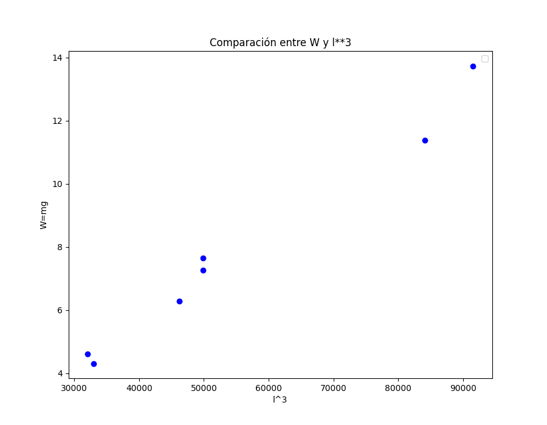
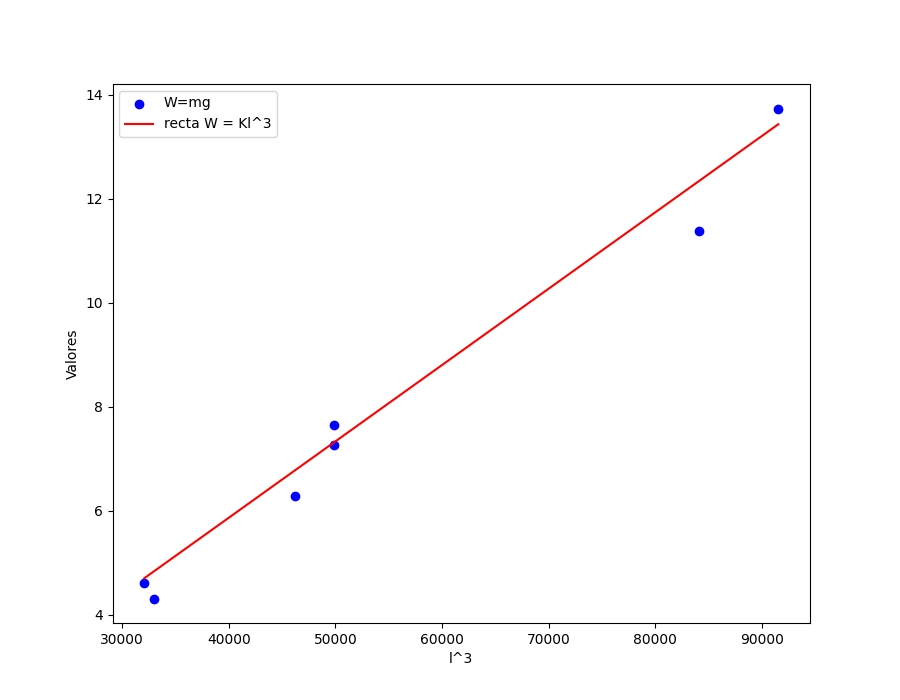
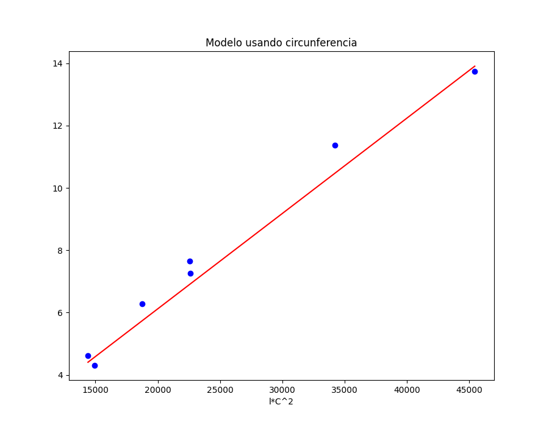

# Modelos de similitud geometrica

## Introducción 
Los modelos de similitud geometrica nos sirven para tratar de "simplificar" algunas tareas que son más complicadas, la idea de usar estos modelos es trasformar problemas complejos en unos que sean más simples de resolver, reduciendo los calculos y dando aproximaciones reales.

En este caso haremos un uso de los modelos de similitud geometrica para el calculo de pesos en una competencia de pesca en la que se premia al pez más pesado, pero la única herramienta con la que contamos para determinar el peso de los peces es una cinta métrica. Como en las versiones anteriores del campeonato asistieron miles de participantes queremos poder predecir el peso de un pescado en término de algunas dimensiones fáciles de medir. A pesar de que el peso de un pescado se ve afectado por variables como la forma del pescado, la densidad del pescado, la edad del pescado, entre otras, haremos un modelo que dependa solo de variables medibles por nuestra cinta métrica.

Algunos de los supuestos que usaremos en nuestro modelo son que:
* la especie está fija y todos los pescados serán robalos. (En general esto sí sucede en los campeonatos).
* la densidad de los pescados es constante. (Esto es poco realista pero nos servirá para un primer modelo).
* las variables como la estación del año, el sexo, la edad, etc. no afectan al peso del róbalo.
* los róbalos son geométricamente similares.

## Primer modelo
Recordando que la densidad ($\rho$) es igual a la masa entre el volumen, podemos calcular el peso ($W$ ) de un pescado multiplicando su volumen por su densidad:

$$ W = V \rho $$

Ahora, bajo nuestro supuesto de densidad constante y de similitud geométrica tenemos
que

 $$ W \propto V $$

 $$ W \propto l^3 $$

A continuación pondremos a prueba nuestro primer modelo con los siguientes datos

| Longitud (cm) | Peso (kg) |
| :---: | :---: |
| 36.81 | 0.78 |
| 31.77 | 0.47 |
| 43.82 | 1.16 |
| 36.82 | 0.74 |
| 32.07 | 0.44 |
| 45.07 | 1.40 |
| 35.89 | 0.64 |

Para poder ajustar nuestro modelo necesitamos datos sobre el peso ($W$ ) y la longitud ($l$)
de los pescados.

Primero graficaremos la comparación $W \propto l^3$ con los datos sacados de la tabla

* Obs:  cuando "pesamos" en kg es la masa, y no el peso de lo que
estemos midiendo, entonces vamos a usar los datos de la masa para obtener el peso ($W = gm$)

Podemos observar que los datos graficados si siguen una relación casi identica 
cuando los graficamos de la forma  $W \propto l^3$  es decir que el modelo si nos esta dando un valor 
muy aproximado del peso real.

### Valor de proporcionalidad
Dado que nuestro modelo nos dice que el peso sigue la relación  $W \propto l^3$, entonces debe existir 
una constante $K$ tal que:

$$ W = k l^3 $$

Ahora encontraremos ese valor $K$.

Por la forma en que graficamos los valores anteriores, dado que en el eje x tenemos los datos
$l^3$ y en el eje y tenemos $W$, entonces la igualdad  $W = k l^3$  nos suguiere una *regresion  lineal*
para encontrar el valor de la constante $K$. la cual sería la constante $m$ de la regresion ($y=mx + b$)

Aqui entra en juego la regresión lineal que habiamos visto en el inicio del curso, la cual se encuentra en 
el archivo `modelos.py`

Una vez que tenemos la constante  $K = 0.00014671200430201652$  podemos hacer la regresión la cual nos ayuda a darnos cuenta
que tan alejados está nuestro modelo de proporcion con los datos que son reales 

En esta regresion podemos ver que el modelo  $W = k l^3$  tiene valores muy cercamos a los puntos reales 
entonces es una buena forma de comprobar que el modelo nos ayudaría a predecir los pesos de los pescados.

## Segundo modelo

El modelo anterior parece ser razonable, pero al aplicarlo premia a los peces grandes e ignora que
hay peces gordos (en nuestro modelo un pez gordo terminará pesando lo mismo que uno
flaco).

Ahora, supondremos que solo la sección transversal de los peces es geométricamente
similar y consideraremos como dimensión característica su circunferencia. Sin embargo, un
un mismo pez la circunferencia es variable así que la definimos como la máxima de las
circunferencias. 

El modelo ahora queda como:

$$ W \propto l C^2 $$ 

en donde C es la circunferencia maxima 

Haremos lo mismo que en el modelo anterior y veremos como se comporta, suponiendo que se cuentan con los siguientes datos:

| Circunferencia maxima |
| :---: |
| 24.77 | 
| 21.29 |
| 27.94 | 
| 24.77 |
| 21.59 |
| 31.75 |
| 22.86 |

Primero hacemos la comparación y graficamos los puntos siguiendo la relacion  $W \propto l C^2$  para despues volver a hacer la regresion lineal 
la cual nos va a mostrar como se ve el modelo en comparación con los datos reales

Podemos ver que este nuevo modelo se parece demasiado al modelo anterior, dandonos un buen resultado
entre los pesos reales y los estimados, asi que podemos concluir que estos modelos pueden sernos de gran ayuda y dependerá del 
objeto real y nuestras metas, para saber cual es nuestro modelo que necesitamos.

