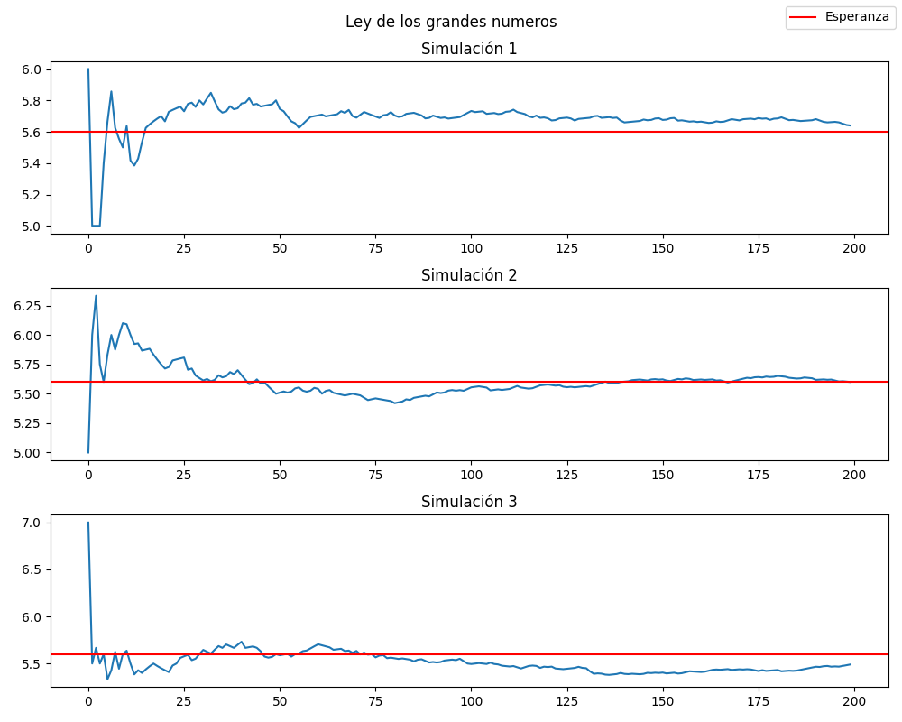

# Fundamentos de simulación 

En esta practica iniciaremos con algunos temas de simulaciones probabilisticas. 


## Ley debil de los grandes numeros 
Uno de los resultados más importantes en la teoria de la probabilidad es la ley de los
grandes números.

Lo que nos dice la ley débil de los grandes números es que si tenemos una sucesión de
variables aleatorias $X1 , X2 ,. . . , Xn$ independientes e identicamente distribuidas, entonces su
promedio converge a la espereza de las variables aleatorias, $ie$

$$\lim_{n \rightarrow \infty} 1/n \sum X_i  \rightarrow E[X_i]$$

En este ejercicio empezamos programando una funcion que devuelve los promedios parciales de uan lista de valores. Nuestra funcion realiza:

$$ S_k = 1/k \sum_{i=1}^{k} X_i$$

donde k = 1,2,..., N

La idea para ver la ley de los grandes numeros fue tomar 3 simulaciones en donde tenemos variables aleatorias binomiales, con parametros $(7, 0.8)$ y 200 valores en cada simulacion. Despues graficamos las sumas parciales en cada iteracion para ir viendo la convergencia hacia la esperanza.

* Resultados:


Como podemos observar la convergencia se nota en buena medida, aunque para verla mucho mejor deberiamos tomar mas muestras. 

## Similar distribuciones 

Para el segundo ejericio simulamos distintas distribuciones apartir de una $Uniforme(0, 1)$

* Bernoulli($p$): 
La distribucion bernoulli es la más simple pues solo devuelve $0$ y $1$. 
La idea es generar un numero $x$ usando la uniforme, si $x$ < $p$ entonces tenemos un 0 y si pasa lo contrario, tenemos un $1$

* Geometrica($p$):
Para generar una distribucion geometrica debemos recordar que de forma intuitiva esta distribucion cuenta el numero de fracasos hasta que salga un exito en la distribucion Bernoulli. Sabiendo esto, solo debemos simular la Bernoulli hasta obtener un exito.

* Exponencial(lambda):
Se necesita el teorema de la transformada inversa donde simplemente tenemos que generar una uniforme(0,1) y al aplicar:
$$-1/ \lambda  ln(1- U)$$
Obtenemos los numeros distribuidos de forma exponencial 

* Pareto(c, $\alpha$):
Al igual que con la exponencial, debemos usar la inversa
$$c / (1-U)^{1/\alpha}$$

y asi generamos los numeros.


## Simular dados
Ahora despues de simular unas distribuciones pasamos a un ejemplo muy tipico de probabilidad: lanzar dados.

* Dado justo:
Para simular un dado justo hacemos uso de la uniforme (0,1) y la idea es que como cada cara tiene la misma probabilidad, entonces basta dividir en intervalo (0, 1) entre las $k$ caras y ver en que subintervalo cayó.

```python 

def dado_justo(k: int):

    u = uniform(0, 1)

    for i in range(k):
        if u < (i+1)/k:
            return i+1
```

* Dado cargado:
La idea es muy similar al dado justo. Usamos una uniforme pero ahora no dividimos el intervalo en las $k$ caras, mas bien dividimos el intervalo en la sumas acumuladas y hacemos lo mismo de ver en que subintervalo cayó la uniforme.

Si tenemos un dado con probas = [0.2, 0.4, 0.1, 0.3] entonces el invervalo se divide de la forma [0, 0.2) [0.2, 0.6) [0.6, 0.7) [0.7, 1)

```python 
def dado_cargado(probas: list):

    k = len(probas)
    u = uniform(0, 1)

    probas_acumuladas = [sum(probas[:i+1]) for i in range(k)]

    for i in range(k):
        if u < probas_acumuladas[i]:
            return i+1

```

Al final todo se basa en la $Uniforme(0, 1)$. 