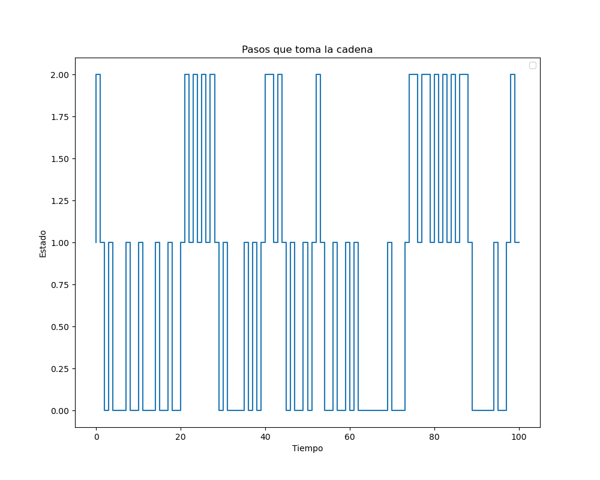
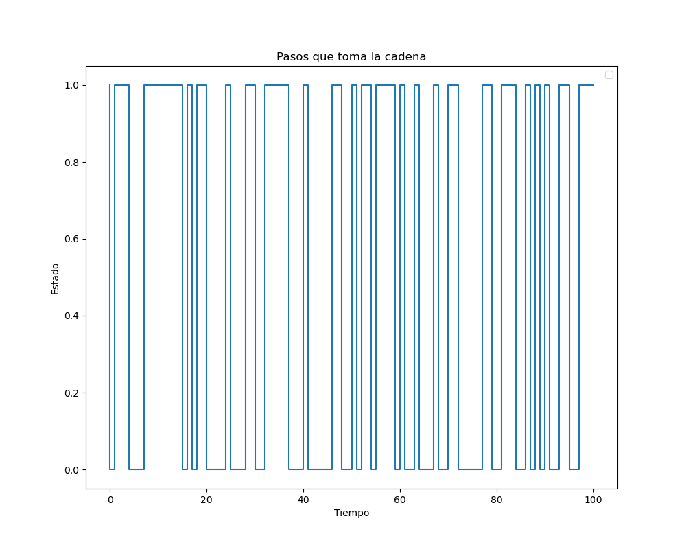
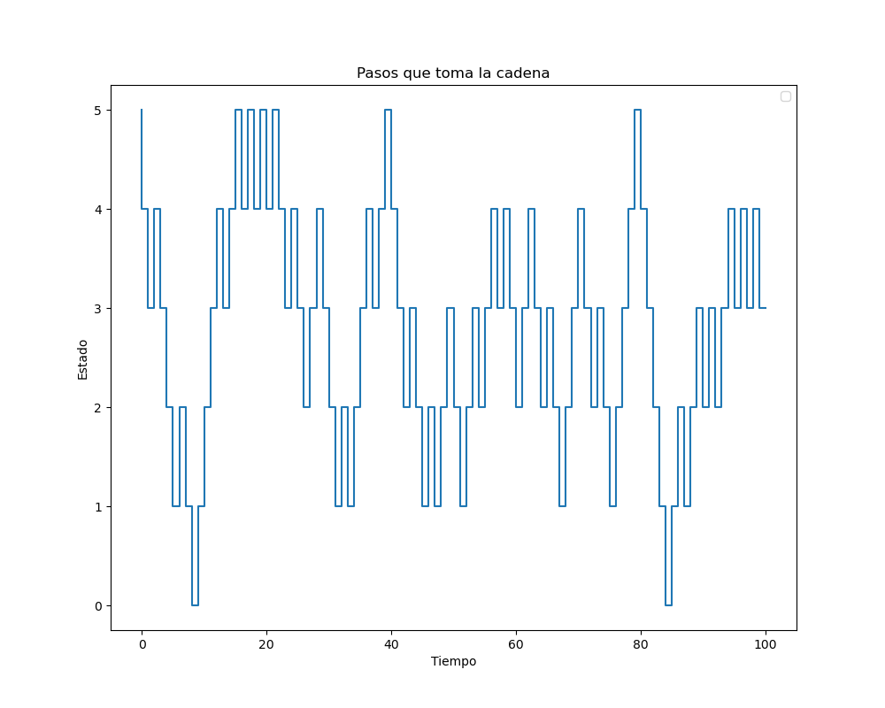
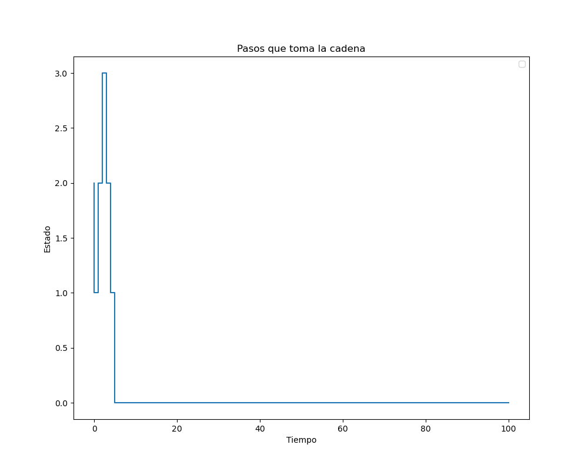

# Cadenas de Markov
En esta practica simulamos cadenas de Markov computacionalmente. 

## Modelos
Creamos tres funciones:

La primera funcion simula un estado en una distribucion dada, por ejemplo si nuestra distribucion es $(0.2, 0.5, 0.3)$ entonces devuelve un estado siguiendo esta distribucion.
```python 
def estado(v:list):

    k = len(v)
    u = uniform(0, 1)

    probas_acumuladas = 0
    for i in range(k):
        probas_acumuladas += v[i]
        if u < probas_acumuladas:
            return i

```

La idea es que debemos generar un numero aleatorio en el (0,1) y ver en que intervalo cayó de acuerdo a nuestra distribucion.


La segunda y tercera funciones son la simulacion de una cadena de Markov (apoyada de la funcion anterior)

El algoritmo funciona de la siguiente forma:

1. Simulamos el estado $X_0$ el cual se obtiene de la distribucion inicial $\pi$. 

2. Ahora generamos un nuevo estado usando la distribucion que nos indica el renglon de la matriz de transicion en el indice igual al estado anterior. 

3. Repetimos hasta tener los $n$ estados que deseamos. 

La segunda funcion sigue un criterio de paro en el que consideramos un numero total de iteraciones $n$.


```python 


def cadena_markov_recorrido(P: np.array, qo: list, iter: int = 100):

    estado_act = estado(qo)
    estados = [estado_act]

    for _ in range(iter):
        dist_actual = P[estados[-1]]

        estado_act = estado(dist_actual)
        estados.append(estado_act)

    return estados
```
La tercera funcion es una cadena de markov pero que se detiene en el momento que llegamos al estado buscado. 


```python
def cadena_markov_busqueda(P: np.array, pi_0: list, estado_busqueda: int, max_iter: int):

    estado_act = estado(pi_0)
    estados = [estado_act]

    i = 0
    while (estados[-1] != estado_busqueda) and (i < max_iter):

        dist_actual = P[estados[-1]]

        estado_act = estado(dist_actual)
        estados.append(estado_act)

        i += 1

    return len(estados)

```


## Simulaciones 
La idea de las simulaciones fue generar una distribucion inicial aleatoria y correr el algoritmo una cantidad $n=100$, luego graficar los estados que iban siendo elegidos para darnos una idea de como se comporta la cadena. 
Tambien probamos con esa misma distribucion, como serian las probabilidades de caer en los estados despues de muchas iteraciones y esto se hace haciendo el producto $\pi P^n$


Los resultados fueron los siguientes:
```python 

P1 = np.array([[0.5, 0.5, 0], 
                [0.5, 0, 0.5],
                [0, 0.5, 0.5]])

```

Recorrido:




Probas despues de 1000 iteraciones: 

las probas de cada estado en el paso 1000 son: [0.33333333 0.33333333 0.33333333]


```python
P2 = np.array([[0.5, 0.5, 0], 
                [0.5,99/200, 1/200], 
                [0, 0, 1]])
```

Recorrido: 



las probas de cada estado en el paso 1000 son: [0.03466295 0.03449007 0.93084699]

```python
P3 = np.array([
    [0, 1, 0, 0, 0, 0],
    [1/5, 0, 4/5, 0, 0, 0],
    [0, 2/5, 0, 3/5, 0, 0],
    [0, 0, 3/5, 0, 2/5, 0],
    [0, 0, 0, 4/5, 0, 1/5],
    [0, 0, 0, 0, 1, 0]
])
```


las probas de cada estado en el paso 1000 son: [0.03158654 0.15456731 0.31586537 0.30913463 0.15793269 0.03091346]

```python
P4 = np.array([
    [1, 0, 0, 0, 0, 0],
    [0.5, 0, 0.5, 0, 0, 0],
    [0, 0.5, 0, 0.5, 0, 0],
    [0, 0, 0.5, 0, 0.5, 0],
    [0, 0, 0, 0.5, 0, 0.5],
    [0, 0, 0, 0, 0, 1]
])

```



las probas de cada estado en el paso 1000 son: [5.96134109e-01 7.37961574e-94 2.05015874e-93 1.19404691e-93
 1.26706778e-93 4.03865891e-01]
