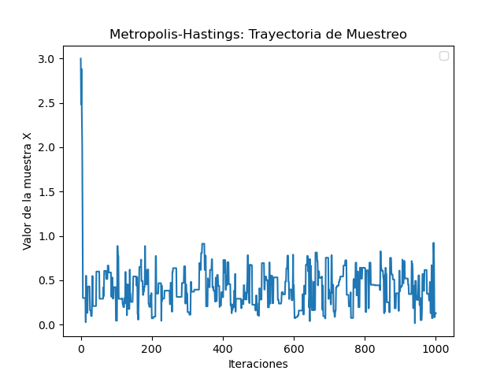
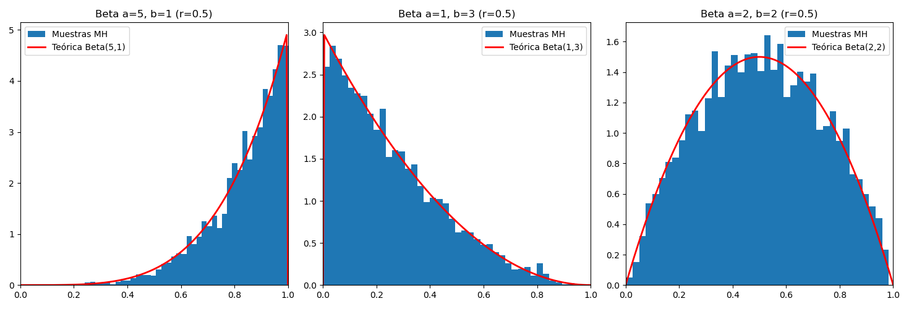

# Metropolis-Hastings
En esta practica implementamos el algoritmo de Metropolis-Hastings para simular variables aleatorias. 

En `Modelos.py` se encuentra la implementacion algoritmica y en `main.py` las simulaciones. 

Despues de correr el algoritmo con la distribucion beta obtuvimos los siguientes resultados.

En la segunda imagen vemos los resultados del algoritmo en comparacion con la distribucion real. 

